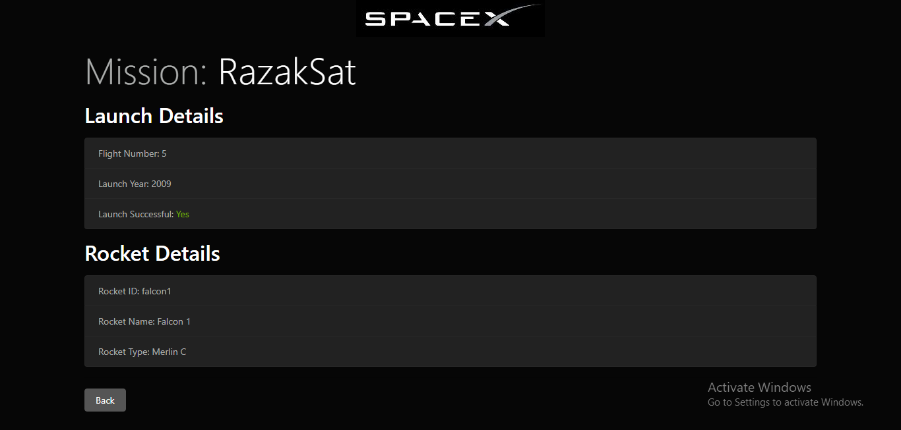

# SpaceX--Info

SpaceX--Info is a web app made using React, GraphQL, Apollo, NodeJS and ExpressJS which fetches data using the API of SpaceX.



## Installation

Use the package manager [npm](https://www.npmjs.com/) to install this app.

```bash
npm install 
```

## License
[MIT](https://choosealicense.com/licenses/mit/)
